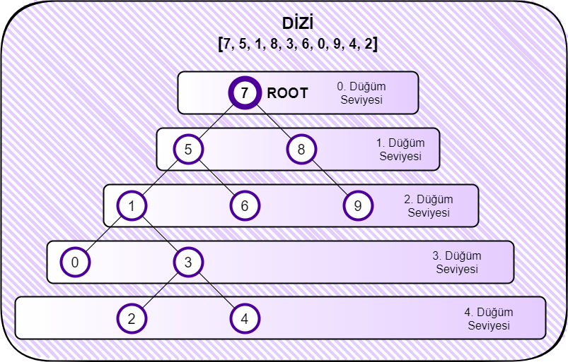

# patika.dev
PatikaDev Proje ödevleri

## Veri Yapıları ve Algoritmalar
## Sıralama Algoritmaları
### Proje 3 - İkili Arama Ağacı (Binary Search Tree)
`[7, 5, 1, 8, 3, 6, 0, 9, 4, 2]` **-> Binary Search Tree**

### 1. Yukarıdaki dizinin Binary-Search-Tree aşamaları nelerdir?

***Görsel Tarif***

