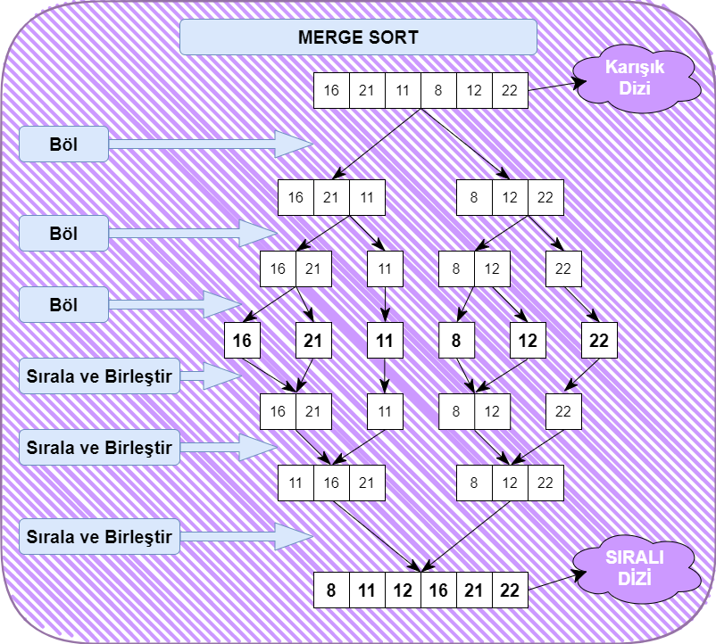

# patika.dev
PatikaDev Proje ödevleri

## Veri Yapıları ve Algoritmalar
## Sıralama Algoritmaları
### Proje 2 Birleştirme Sıralaması (Merge Sort)
`[16, 21, 11, 8, 12, 22]` **-> Merge Sort**

### 1. Yukarı verilen dizinin birleştirmeli sıralama (merge sort) türüne göre aşamaları nelerdir?

***Görsel Tarif***

### 2. Big-O gösterimi -> ***O(nLogn)***
